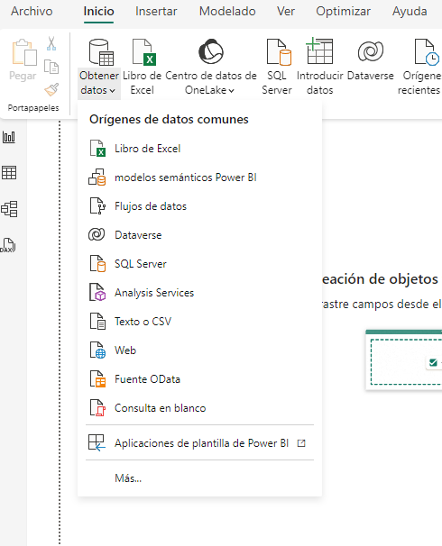
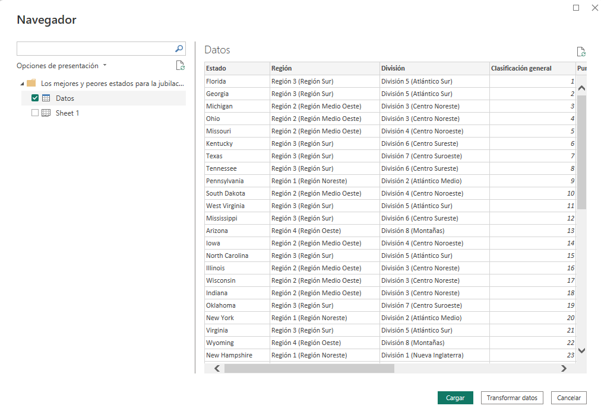
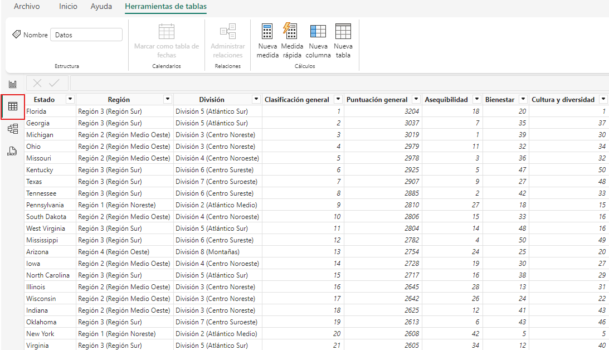
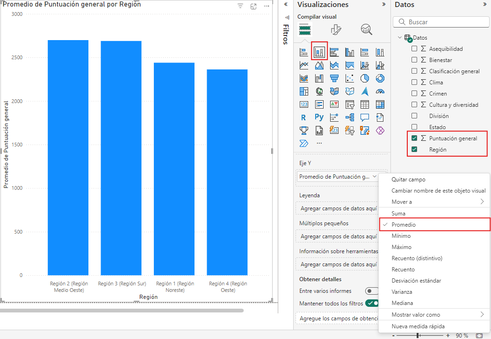
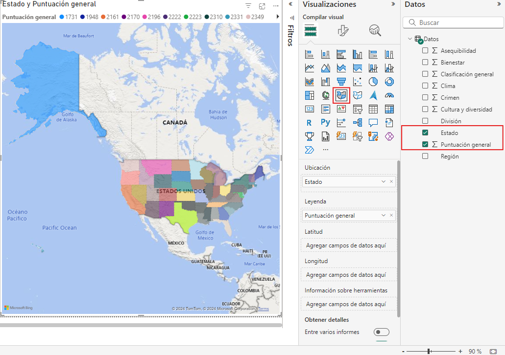
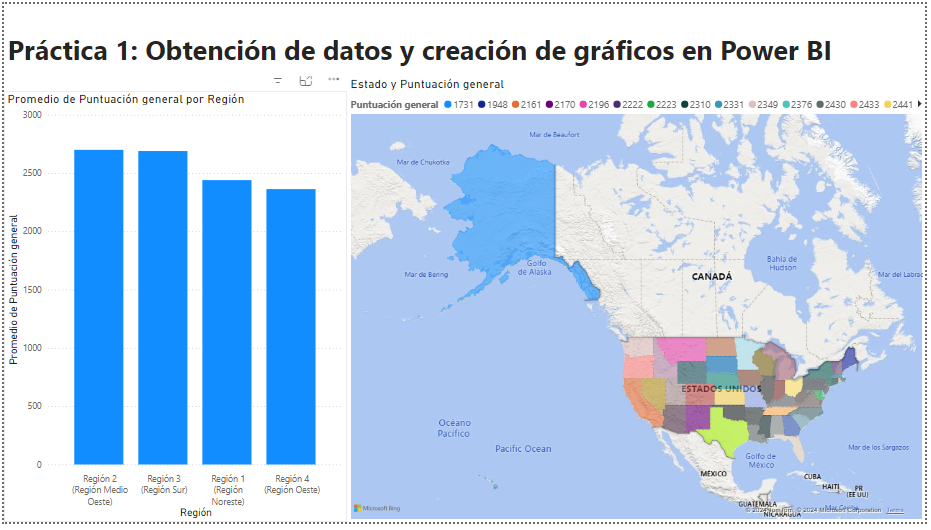

# Práctica 1. Cargar datos en Power BI Desktop

## Objetivo de la práctica:

Al finalizar la práctica, serás capaz de:

- Cargar datos a Power BI Destkop y crear un gráfico en Power BI.

## Duración aproximada:

- 40 minutos.

## Instrucciones 

**Descripción:** Imagina a una persona que está cerca de jubilarse y está considerando mudarse a un lugar con abundante sol, bajos índices de delincuencia y acceso a servicios médicos de alta calidad. O tal vez se trate de un analista de datos que busca esa información para asesorar a sus clientes. Por ejemplo, podría ayudar a un distribuidor de gafas de sol a enfocar sus promociones de ventas en las zonas donde hace sol con más frecuencia.

 > ***Nota**: Para completar este ejercicio, usa el archivo que se encuentra en el repositorio de datos del curso **_“Los mejores y peores estados para la jubilación 2022”_** de formato .xls.*

### Tarea 1. Obtención de datos en Power BI.

1. Abre **Power BI Desktop** y crea un nuevo informe en blanco.

2. Selecciona la pestaña **Inicio** de la cinta de opciones y haz clic en **Obtener datos > Libro de Excel.**
   

3. Realiza la carga de datos en Power BI desktop del archivo **_“Los mejores y peores estados para la jubilación 2022”_**.

5. En la ventana **Navegador** encontrarás las opciones que se disponen para cargar datos. Se muestra las tablas y las hojas de cálculo que se encuentran en el archivo cargado. Selecciona la opción **Datos** y luego haz clic en **Cargar**.

    > ***Nota**: Es recomendable usar tablas, ya que Power BI trabajará mejor con un conjunto de datos bien organizado, lo que facilita el proceso de limpieza, modelado y visualización.*

6. En la pestaña **Vista de Tabla** podrá visualizar los datos cargados. Examinar en cada columna el tipo de dato, valores, categoría y formato.

### Tarea 2. Creación de gráficas en Power BI.

Se puede realizar un análisis rápido de los datos con el fin de ver **el promedio de puntaje según las regiones de Estados Unidos**, el gráfico que se puede utilizar es un gráfico de columnas apiladas.

1. Dirígete a la pestaña **Vista de informe**, donde podrás insertar gráficos desde el panel de **Visualizaciones**.

2. Inserta el **gráfico de columnas apiladas.**

3. Selecciona en el panel **Datos** los campos: **Puntuación General** y **Región**.

4. En el panel **Visualizaciones**, en el campo **Eje Y**, despliega el menú y selecciona **Promedio**.

    > ***Nota**: La gráfica muestra el promedio de puntaje según las regiones de los Estados Unidos.*

    

5. Inserta la segunda gráfica de visualización. Haz clic en **Mapa Coroplético** y selecciona los campos en el panel datos: **Estado** y **Puntaje general.**

    >***Nota**: La gráfica muestra el puntaje según cada estado de los Estados Unidos.*

    

6. Guarda el archivo, da clic en **Archivo**, selecciona **Guardar o Guardar Como**, por último, elige **ubicación**.
    
## Resultado esperado:

Los objetos visuales puedes organizarlos en el lienzo del informe.

>***Tip**: Explora los diferentes origenes de datos comunes para obtener datos y los diferentes tipos de objetos visuales para analizar los datos cargados.*

Ahora puedes utilizar los datos para relizar cálculo y visualización de datos. En la pestaña de informes de Power BI Desktop podrás realizar los objetos visuales para analizar los datos cargados.
