# Práctica 2. Obtención y preparación de datos

## Objetivo de la práctica:

Al finalizar la práctica, serás capaz de:

- Aplicar transformaciones de los datos en el Editor de Power Query durante su carga y presentación.  
- Preservar el origen de datos original al dar forma a los datos.

## Duración aproximada:

- 40 minutos.

## Instrucciones 

**Descripción:** Ahora que ya se tiene un modelo de datos y análisis de datos, resulta que hay datos en la web que pueden servir para incluirse en el modelo de datos, hay que hacer procesos de depuración y limpieza de datos, junto con actividades de combinaciones de tablas, esto ayudará para dar un mejor detalle de los datos.

> ***Nota:** En esta práctica usa el archivo resultante del laboratorio anterior: **Práctica 1: Cargar datos en Power BI Desktop.***

1. Abre el archivo resultante del laboratorio: **Práctica 1: Cargar datos en Power BI Desktop**.

2. Da clic en la pestaña **Inicio**, en la sección **Consultas**, selecciona **Transformar datos** para abrir la ventana del Editor de Power Query.

    > ***Nota:** Usa los datos del siguiente enlace para depurar y combinar consultas: http://en.wikipedia.org/wiki/List_of_U.S._state_abbreviations*

    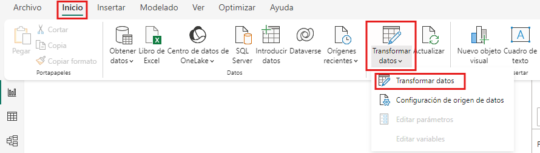

### Tarea 1. Obtención de datos.

> ***Importante:** Al transformar los datos en el Editor de Power Query de Power BI, se proporciona instrucciones específicas que éste ejecuta para limpiar, ajustar y dar forma a los datos antes de que se carguen en el modelo de datos. Éstas transformaciones no alteran el origen de datos original. Éste proceso permite filtrar, quitar filas y columnas, combinar datos, entre muchas otras operaciones, garantizando que los datos estén listos para su análisis.*

1. En el **Editor de Power Query**, en la pestaña **Inicio** de la cinta de opciones, selecciona **Nuevo origen > Web**.

    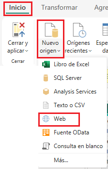

2. A continuación, copia y pega la dirección web proporcionada y selecciona **Aceptar**. En la ventana del navegador, observa la vista previa de lo que se encuentra en dicha página web.

    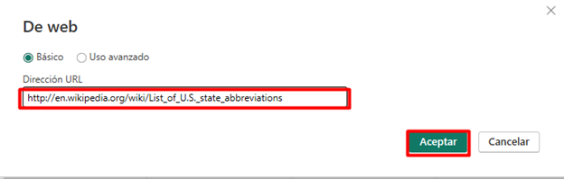

3. Selecciona la tabla **Codes and abbreviations...**.

4. Selecciona **Aceptar** para impotar los datos al **Editor de Power Query** y poder realizar transformaciones a los datos.

    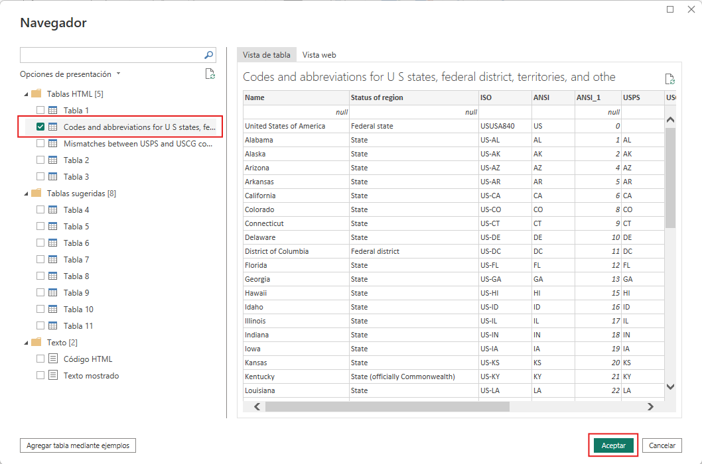 

### Tarea 2. Preparación de datos.

El Editor de Power Query cuenta con características para limpiar y preparar datos para el análisis, como quitar filas y columnas, filtar y combinar datos, entre otras. Vamos a preparar los datos obtenidos.

### Tarea 3. Quitar filas.

Las tres primeras filas de los datos cargados son el resultado de la forma en que se creó la tabla de la página web, para este caso, no se requieren. Para removerlas:

1. En la pestaña **Inicio** de la cinta de opciones, en la sección **Reducir filas**, da clic en **Quitar filas > Quitar filas superiores**.

    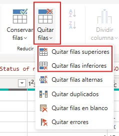

2. En el cuadro de diálogo, escribe "1" como el número de filas que se van a quitar.

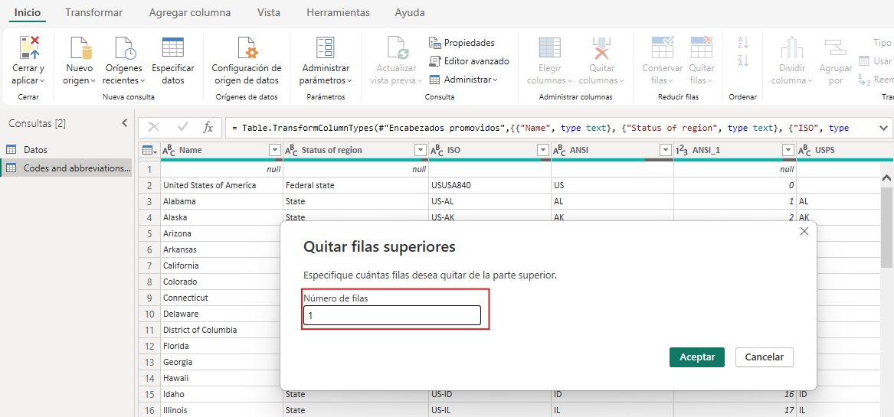

Se quitarán algunas filas inferiores que son territorios que no hacen falta que se incluyan en el análisis de datos.

3. Selecciona **Quitar filas > Quitar filas inferiores** y escribe "26" como el número de filas que se deben quitar.

    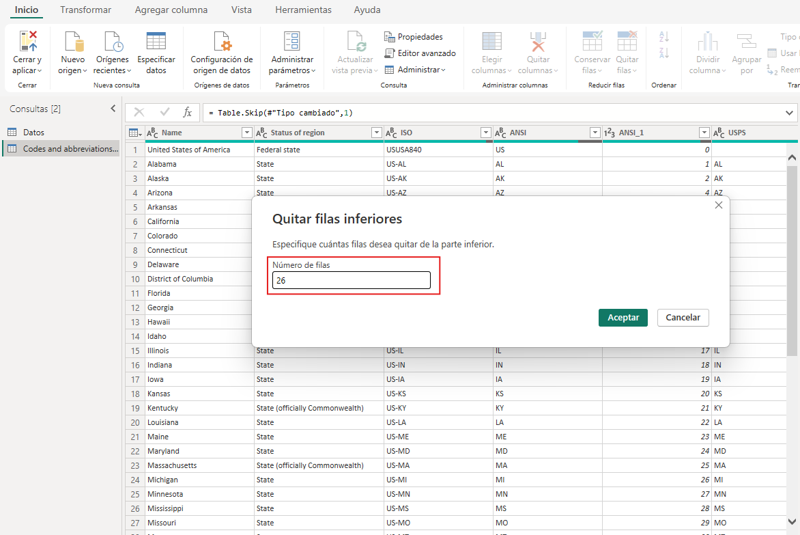

Al cargar los datos, el navegador puede dectectar u omitir la fila de encabezado de la página. En caso de que se omita el encabezado, puedes utilizar la primera fila como encabezado.

4. En la pestaña **Inicio**, sección **Transformar**, selecciona la opción **Usar la primera fila como encabezado**.

    > ***Nota:** Si al cargar los datos la tabla cuenta con encabezado, no es necesario modificar.*
    
    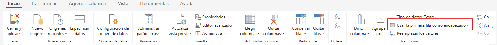

### Tarea 4. Filtrar datos.

La tabla de estadísticas de jubilación no incluye el distrito federal de **District of Columbia**, por lo que se excluirá de la lista.

1. Selecciona la flecha desplegable situada junto a la columna **Federal state**, luego, desactiva la casilla **Federal district**.
    
    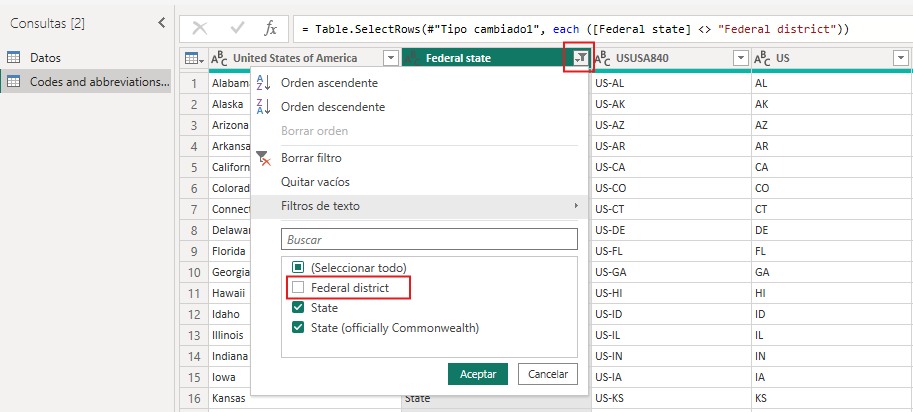

### Tarea 5. Quitar columnas.

Solo es necesario asignar a cada estado su abreviatura oficial de dos letras, esta información se porporciona en la primera y la cuarta columna. Por tanto, dejar esas dos columnas y quitar el resto.

1. Selecciona la primera columna, mantén presionada la tecla **CTRL** y vuelve a seleccionar la cuarta columna.

2. Da clic en la pestaña de **Inicio** de la cinta de opciones, en la sección **Administrar columnas**, selecciona la opción **Quitar columnas > Quitar otras columnas**.

    > ***Nota:** Esta opción quita todas las columnas no seleccionadas.*

    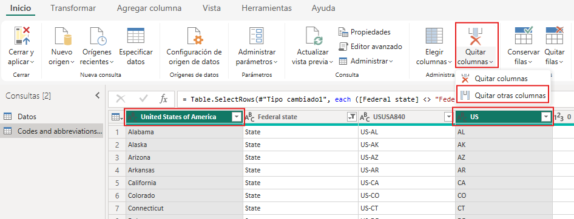

3. Cambia el nombre de las columnas **United States of America** y **US** por **Nombre de estado** y **Código de estado**, respectivamente.

    >***Nota:** Hay otras formas para realizar el proceso para el cambio de nombre de una columna o tabla.*

- Selecciona el encabezado de la columna y da doble clic para habilitar el campo para editar.

    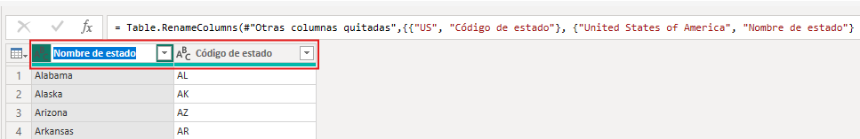

4. Cambia el nombre de las tablas **Codes and abbreviations** y **Datos** por **CodigosEstado** y **EstadosJubilacion**, respectivamente.

- En el panel **Configuración de la consulta** en la sección **Propiedades** de cada tabla o consulta, en la opción **Nombre** ingresar el nombre nuevo de la tabla.

    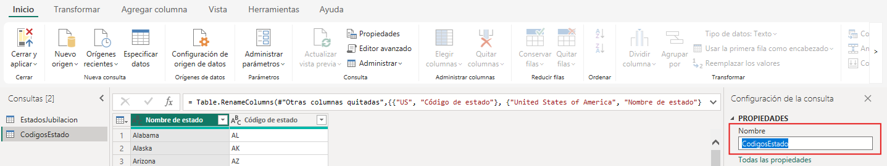

### Tarea 6. Combinar datos.

Ahora que se ha dado forma a la tabla **CódigosEstado**, se pueden combinar las dos tablas en una. Dado que las tablas que tienes ahora son el resultado de las transformaciones aplicadas a los datos, se conocen a menúdo como consultas.

Hay dos formas principales de combinar las consultas: **combinar** y **anexar**:

1. Cuando se tiene una o varias columnas que se quieran agregar a otra consulta, **combinar las consultas**.  
2. Cuando se tiene filas de datos adicionales que se quieran agregar a una consulta existente, **anexar la consulta**.

En este caso, se combinarán las consultas.

1. Selecciona la consulta **EstadosJubilacion**.

2. En la pestaña de **Inicio** de la cinta de opciones, en la sección **Combinar**, haz clic en **Combinar consultas**.

    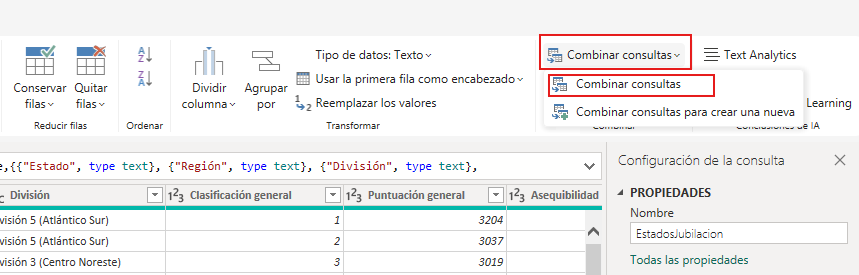

3. Se abrirá la ventana **Combinar**, en ésta se debe seleccionar una tabla y las columnas coincidentes para crear una tabla combinada.

4. Selecciona la columna **Estado** en la tabla **EstadosJubilacion**.

5. En el menú desplegable, selecciona la tabla (consulta) **CodigosEstado**.

6. Selecciona la columna **Nombre de estado** de la tabla (consulta) **CodigosEstado** y, posteriormente, da clic en el botón **Aceptar**.

    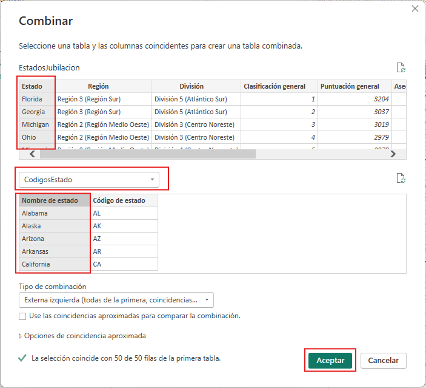

Se crea la columna **CodigosEstado** al final de la consulta **EstadosJubilación**, que incluye el contenido de la tabla **CodigosEstado** que se combinó con la consulta existente. 

Todas las columnas de la consulta combinada se comprimen en la columna **CodigosEstado**, pero se puede expandir la tabla e incluir las columnas que se requieran. 

7. Selecciona el ícono **Expandir** ubicado al lado derecho del nombre la columna **CodigosEstado**. De esta forma, aparecerá el cuadro de diálogo **Expandir**.

8. En este caso, solo se desea la columna **Código de estado**. Selecciona únicamente dicha columna y haz clic en **Aceptar**.

9. Desactiva la casilla **Usar el nombre de columna original como prefijo**.

    > ***Nota:** Al usar esta opción, la columna combinada adoptará el nombre  **CodigosEstado.Código de estado** (el nombre de columna original o NewColumn, seguido de un punto y el nombre de la columna importada en la consulta).*

    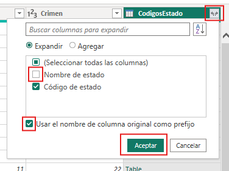

10. Aplica los cambios en el **Editor de Power Query** y cargarlos en Power BI Desktop. Seleccionar en la pestaña de **Inicio**, en la sección **Cerrar**, la opción **Cerrar y aplicar**.

    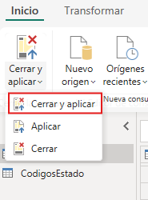

11. Guarda archivo de Power BI Desktop. Selecciona **Archivo > Guardar** en la pestaña **Inicio** de la cinta de opciones para guardar el informe.

## Resultado esperado:

Ahora se tiene una sola consulta (tabla) que combina dos orígenes de datos, cada uno de los cuales se ha adaptado para satisfacer las necesidades. Esta consulta puede servir como base para una gran cantidad de conexiones de datos adicionales. Por ejemplo, las estadísticas de los costos de las viviendas, los datos demográficos o las oportunidades de trabajo de cualquier estado.

- Consulta **EstadosJubilados** donde se combinan los dos origenes.

    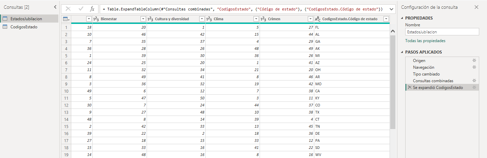

- Consulta **CodigosEstado** donde se realizó las transformaciones y preparación de los datos tomados del origen de datos en la web.

    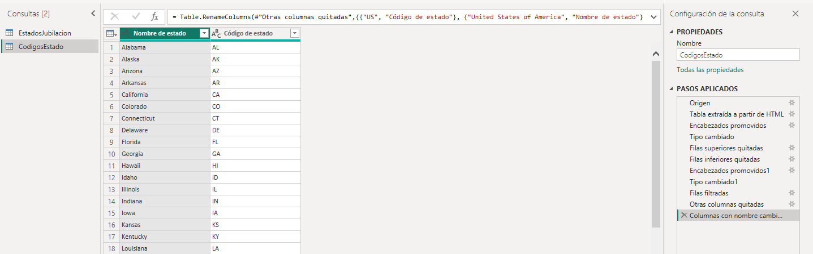
