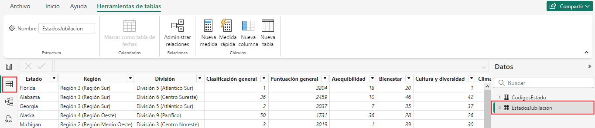
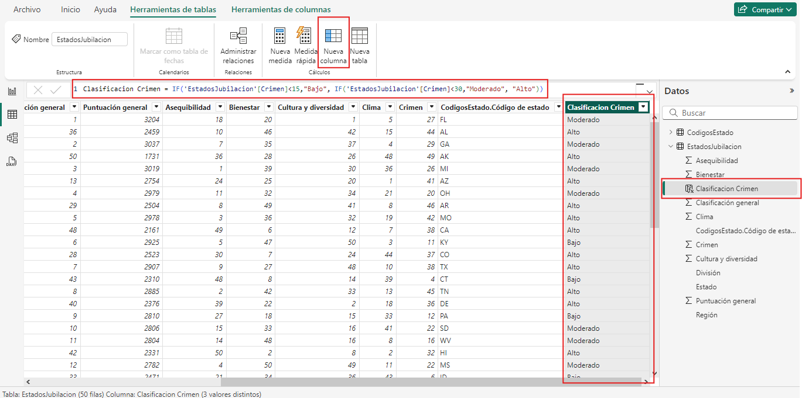
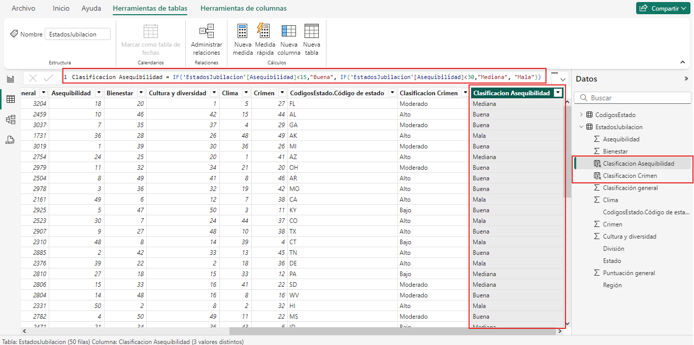
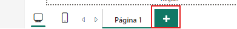
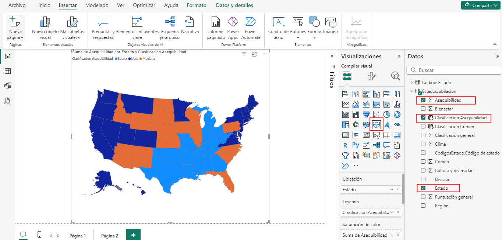
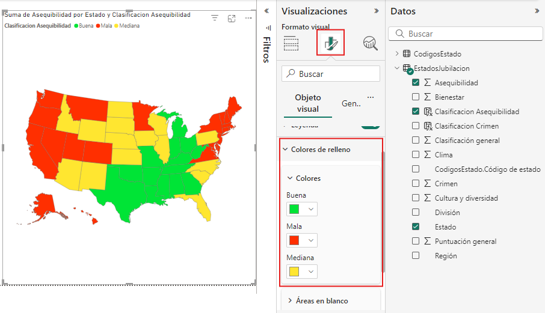
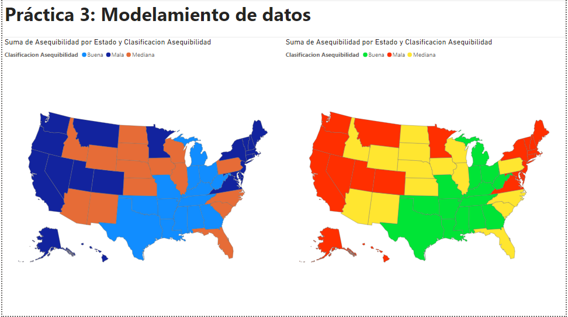

# Práctica 3. Modelamiento de datos.

## Objetivo de la práctica:

Al finalizar la práctica, serás capaz de:

- Crear campos calculados condicionales para clasificar datos en Power BI. <br>
- Visualizar datos clasificados en mapas de formas en Power BI.

## Duración aproximada:

- 40 minutos.

## Instrucciones 

**Descripción:** Se necesita analizar los datos de clasificación de los estados más convenientes para vivir en los Estados Unidos, basándose en condiciones personalizadas que serán creadas mediante campos calculados.

> ***Nota:** En esta práctica, usa el archivo resultante del laboratorio anterior: **Práctica 2: Obtención y preparación de datos**.*

1. Abre el archivo resultante del laboratorio: **Práctica 2: Obtención y preparación de datos**.

### Tarea 1. Crear una columna calculada. 

1. En el panel de vistas, selecciona **Vista de Tabla**.

2. Selecciona la consulta **EstadosJubilacion** en el panel de campos de **Datos**.

    

Se crearán campos condicionales que facilitarán el análisis de los factores de **crimen** y **asequibilidad**.

3. Da clic en la pestaña **Herramientas de tablas** en la cinta de opciones, en la sección **Cálculos**, selecciona **Nueva columna**.

4. En la **barra de fórmulas**, ingresa la siguiente expresión DAX para crear una **columna calculada** que muestra la **clasificación del crimen** en los estados de Estados Unidos.

    ```dax  
    Clasificacion Crimen = IF('EstadosJubilacion'[Crimen]<15,"Bajo", IF('EstadosJubilacion'[Crimen]<30,"Moderado", "Alto"))
    ```
    

5. Crea una nueva columna calculada, esta mostrará la clasificación de asequibilidad en los estados de Estados Unidos.

    ```dax  
    Clasificacion Asequibilidad = IF('EstadosJubilacion'[Asequibilidad]<15,"Buena", IF('EstadosJubilacion'[Asequibilidad]<30,"Mediana", "Mala"))
    ```
    

### Tarea 2. Analizar campos calculados como leyenda.

Ahora, debes utilizar el campo condicional creado como **leyenda** para analizar en un mapa de formas (objeto visual) los estados con buena, mediana o mala asequibilidad.

1. En el panel de vistas, selecciona **Vista de informe**.

2. En la parte inferior, añade una página para trabajar en un nuevo **lienzo de informe**.

     

3. En el panel de **Visualizaciones**, selecciona el objeto visual **Mapa de formas**.

    >***Importante:** El objeto visual **Mapa de formas** solo está disponible en Power BI Desktop y no en el servicio Power BI ni Power BI Mobile. Como está en versión preliminar, debe habilitarse para poder usarlo. Para habilitar Mapa de formas, selecciona **Archivo > Opciones y configuración > Opciones > Características de versión preliminar** y activa la casilla **Dar forma a objeto visual de mapa**. Deberás reiniciar Power BI Desktop después de realizar la selección.*

4. En el panel de datos, selecciona los campos: **Asequibilidad**, **Clasificacion Asequibilidad** y **Estado**.
    
    

### Tarea 2. Configurar colores y rellenos.

Para optimizar la visualización y facilitar el análisis, ajusta los colores en la leyenda, utilizando una paleta que resalte claramente las diferencias entre las categorías. Esto ayudará a mejorar la interpretación de los datos y permitirá identificar patrones y tendencias de forma más efectiva.

1. Para ajustar los colores en la leyenda, dirígete al panel **Visualizaciones**, selecciona la opción **Dar formato a objeto visual (icono de pincel)**, donde se desplegará las opciones para cambiar formato del objeto visual.  

2. Entre las opciones desplegar el menú de **Colores de relleno**, podrás cambiar cada color para cada una de las etiquetas existentes.

    

Ahora podrás analizar los datos por medio de condicionales con el fin de distinguir que estados tiene alto crimen y una buena asequibilidad.

## Resultado esperado:

Al interactuar con el **Lienzo del informe**, se puede ordenar los objetos visuales insertados.


