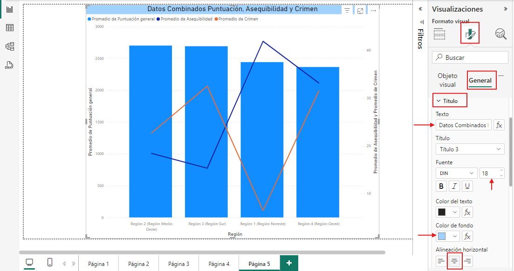

# Práctica 4. Visualizaciones de datos

## Objetivo de la práctica:

Al finalizar la práctica, serás capaz de:

- Analizar los datos mediante objetos visuales atractivos.

## Duración aproximada:

- 40 minutos.

## Instrucciones 

**Descripción:** Según el estudio de Bankrate, Florida es el mejor estado para jubilarse en 2022, seguido de Georgia, Michigan, Ohio y Missouri.  Sin embargo, Alaska ocupó el último lugar en el ranking. El estado se vio arrastrado hacia abajo por puntajes mínimos en bienestar y clima. Alaska ocupó el primer lugar en una subcategoría: sus residentes soportan la carga fiscal más baja del país.

> ***Nota:** En esta práctica usa el archivo resultante del laboratorio anterior: **Práctica 3: Modelamiento de datos**.*

1. Abre el archivo resultante del laboratorio: **Práctica 3: Modelamiento de datos**.

>***Importante:** Para cada objeto visual, crea una nueva página seleccionando el simbolo "+" en la parte inferior, desde cada vista de reporte.*

Selecciona el elemento visual y modifica su tamaño para que ocupe el lienzo en la página.

### Objeto Visual - Treemap.

1. Seleccionar en el panel **Visualizaciones** el objeto visual **Treemap**.

2. Para este objeto visual, utuliza el campo de **Región** como **Categoría**, el campo de **Estado** para obtener el **Detalles** y el campo de **Puntuación General** para **Valores**.

### Objeto Visual - Mapa de forma.

1. Selecciona en el panel **Visualizaciones** el objeto visual **Mapa de forma**.

2. Para este objeto visual utiliza el campo **Estado** como **Ubicación** y el campo **Puntuación general** para la saturación del color.

    

3. En este caso, cambia el color de relleno en la configuración de formato.

    > ***Nota:** Ten seleccionado el objeto visual y selecciona **Dar formato a objeto visual (icono de pincel)** y en **Colores de relleno**, configura el color degradado con tonos de azules oscuros y claros.
    
    

### Objeto Visual - Gráfico Combinado

1. Selecciona en el panel **Visualizaciones** el objeto visual **Gráfico de columnas apiladas y de líneas (Gráfico Combinado)**.

2. Para este objeto visual utiliza el campo **Región** como **eje X** y el **Promedio** de **Puntuación General** como **Eje Y**, esto con el fin de ver qué región de Estados Unidos tiene el promedio de puntuación más alto.

3. Para el gráfico cruzado utiliza el **promedio** de **Asequibilidad** y el **promedio** de **Crimen** como **Eje Y de linea**. Esto con el fin de analizar la relación entre una alta puntuación general, considerando la asequibilidad y el crimen, como factores incidentes en la puntuación general.

     

4. Para el gráfico combinado realizar configuraciones de **Título:** Etiquetas, Leyendas, Marcadores, Bordes, Rellenos, Fuentes, etc. Con el fin obtener un gráfico atractivo para el análisis.
Para editar el título, desde la configuración del formato, selecciona la vista **General > Título** y edita los campos de la siguiente manera:
    
    - **Texto:** Datos Combinados Puntuación, Asequibilidad y Crimen.
    - **Título:** Título 3.
    - **Fuente:** DIN , 18.
    - **Color de fondo:** Azul Claro.

    

5. Luego, para agregar las etiquetas y marcadores, regresa a **Objeto visual** y en la parte inferior, activa las opciones de **Marcadores y Etiquetas de datos.**

    

## Resultado esperado:

Ahora que las visualizaciones están completas, es momento de analizar los factores que influyen en la clasificación de los estados. Se deben evaluar criterios como la asequibilidad, el índice de criminalidad y otros aspectos relevantes para obtener una visión clara de las tendencias. Con base en esta información, se podrán tomar decisiones informadas sobre **cuál sería el estado más adecuado para visitar o vivir en Estados Unidos, considerando las preferencias y prioridades personales**

