# Práctica 5. Herramientas de Power BI

## Objetivo de la práctica:

Al finalizar la práctica, serás capaz de:

- Utilizar herramientas de datos, navegación, y visualización con el fin de crear un análisis de datos de mayor calidad.

## Duración aproximada:

- 40 minutos.

## Instrucciones 

**Descripción:** En este ejercicio, debes analizar los datos de clasificación para determinar cuáles son los estados más convenientes para vivir en Estados Unidos, evaluando qué variables influyen más en el ranking final. Para lograrlo, es necesario realizar una **clasificación de variables discretizadas**, es decir, agrupar las variables en categorías que faciliten su análisis. Además, deberá profundizar en los datos, organizándolos por **jerarquías** de Región, División y Estado, lo que permitirá desglosar y analizar la información a diferentes niveles de detalle.

> ***Nota:** En esta práctica usa el archivo resultante del laboratorio anterior: **Práctica 4: Visualizaciones de datos**.*

1. Abre el archivo resultante del laboratorio: **Práctica 4: Visualizaciones de datos.**

### Tarea 1. Crear jerarquías para región.

Crea una jerarquía con los datos que incluirá las categorías de **Región, División y Estado** para facilitar una representación gráfica detallada y permitir un drill down eficiente, explorando datos en distintos niveles de detalle.

1. En el panel de vistas, selecciona **Vista de modelo**.

2. Selecciona la consulta **EstadosJubilacion** en el panel de campos de **Datos**.

    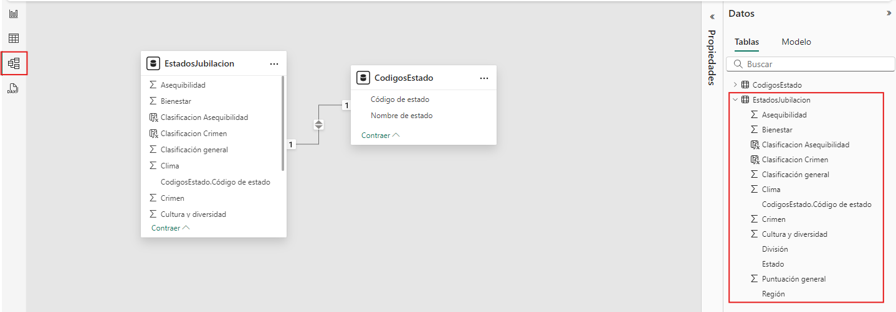

3. Da clic derecho sobre **Región**, selecciona **Crear jerarquía**. Se creará un nuevo elemento llamado **Región jerarquía**.

    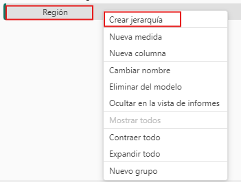

4. Seleccionar el campo **Región Jerarquía**, en el panel **Propiedades**, en la opción **Jerarquía** dar clic en **Seleccionar columna para agregar** e ingresar la columan **División** y **Estado**.

    >***Nota:** El orden de la jerarquía debe ser **Región > División > Estado***.

5. Da clic en **Aplicar cambios en el nivel**.

    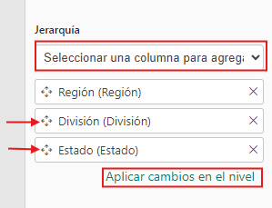 

### Tarea 2. Crear visualizaciones usando jerarquía.

1. En el panel de vistas, seleccionar **Vista de informe**.

2. En el panel de **Visualizaciones**, insertar objeto visual de **Matriz**.

    >***Nota:** Crear una nueva página seleccionando el simbolo "+" en la parte inferiror, desde cada vista de reporte.*

3. Para configurar el objeto visual, agregar el campo **Región Jerarquía** a **filas** y los campos **Asequibilidad, Clasificación general y Crimen** como **promedio** a **Valores**.
    
    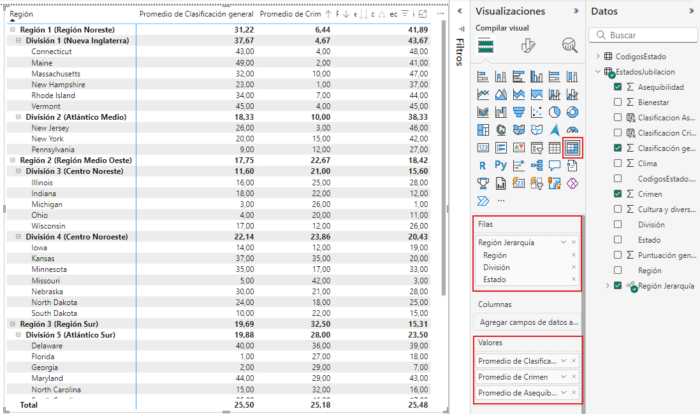

4. Crear nueva página y agregar objeto visual de **Columans apiladas y de lineas**.

5. Configurar gráfico ingresando el campo **Región Jerarquía**.

6. Insertar el campo **Clasificación general** a **Eje Y de columna** y el campo **Crimen** a **Eje Y de liínea**.
    
    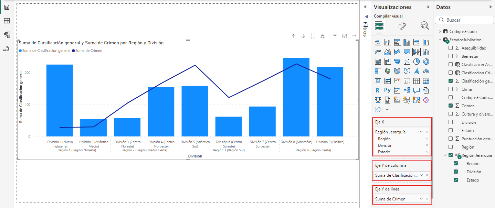
7. En las opciones del objeto visual **Gráfico de columanas apiladas** en el lienzo del informe, dar clic en icono de **Expandir todo un nivel en la jerarquía**. Mostrará el objeto visual con mayor detalle.

    > ***Nota:** Interactuar con las opciones de visualización del gráfico para ver cada nivel de la jerarquía.*

    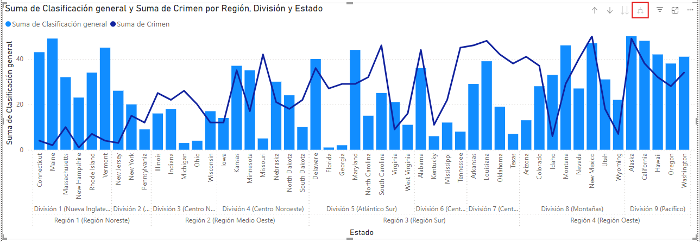

### Tarea 3. Crear discretización y grupos de listas.

La **discretización** y los **grupos de listas** son herramientas que permiten organizar y simplificar datos, facilitando el análisis y la visualización.

#### Tarea 4. Discretización.

1. En el panel de vistas, seleccionar **Vista de tabla**.

2. Seleccionar el campo **Clasificación general**.

3. En la pestaña **Herramientas de columnas**, dar clic en **Grupos de datos** y seleccionar **Nuevos grupos de datos**.

    >***Nota:** Adicional se puede crear un grupo al dar clic derecho en el campo y en el menú desplegable dar clic en **nuevo grupo.** 

    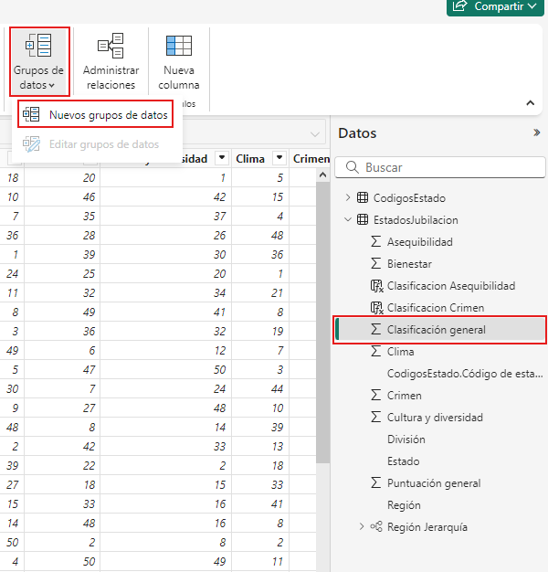

4. En la ventana de grupos, editar:   

    - **Nombre:** Discretizacion Clasificación general  
    - **Tipo de grupo:** Discretizar 
    - **Tipo de las discretizaciones:** Tamaño de las discretizaciones 
    - **Tamaño de la discretización:** 10 

    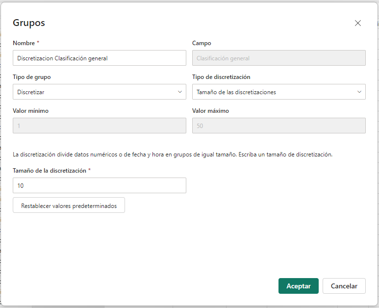

#### Grupo de lista.

1. Seleccionar el campo **Discretizacion Clasificación general**.

2. En la pestaña **Herramientas de columnas**, dar clic en **Grupos de datos** y seleccionar **Nuevos grupos de datos**.

3.  En la ventana de grupos, editar:   

    - **Nombre:** Estado de clasificacion 
    - **Tipo de grupo:** Lista 
    - **Agrupar**
    
        - **Nombre:** Buena
        
            - **Grupo:** 0, 10, 20

        - **Nombre:** Mala

            - **Grupo:** 30, 40, 50

    >***Nota:** Para agrupar debes seleccionar los valores no agrupados presionando la tecla CTRL y dando clic sobre los valores, luegos dar clic en **Agrupar**. En **Grupos y miembros** dar doble clic sobre el nombre del grupo para poder editarlo.*
    
    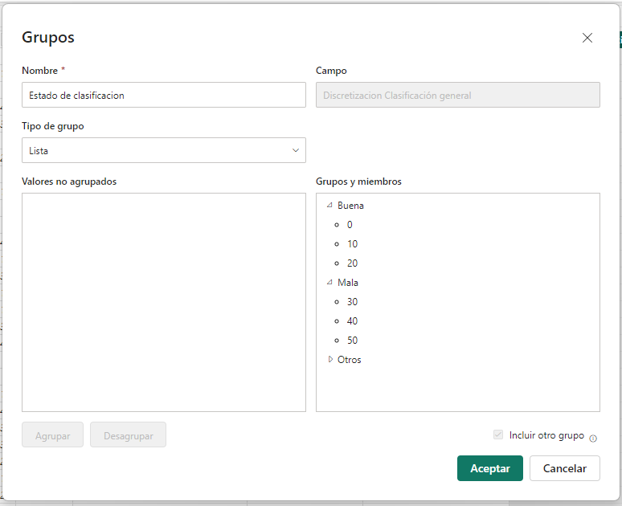

### Tarea 5. Crear visualizaciones y modificar interacción.

La función de **editar interacciones** permite controlar cómo los distintos objetos visuales (gráficos, tablas, mapas, etc.) se afectan entre sí cuando se interactúa con uno de ellos. Esto mejora la personalización de los informes y permite un análisis más controlado y preciso.

1.  En el panel de vistas, seleccionar **Vista de informe**.

    >***Nota:** Crear una nueva página seleccionando el simbolo "+" en la parte inferiror, desde cada vista de reporte.*
    
2. En el panel **Visualizaciones**, seleccionar **Gráfico de anillos**, se crearán varios objetos visuales. 

3. Agregar el campo **Estado de clasificacion** a **Leyenda** y en **Valores** de cada objeto visual agregar el **Promedio** de **Asequibilidad**, **Bienestar**, **Clima**, **Crimen** y **Cultura y diversidad**.

    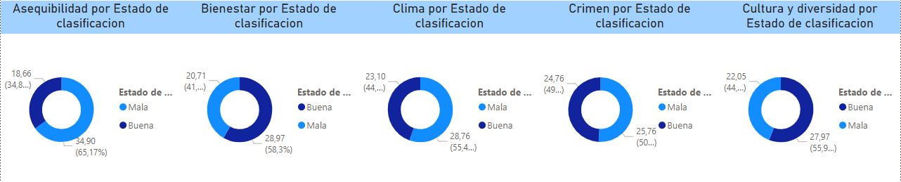

4. Al seleccionar un objeto visual, se habilita la pestaña **Formato**, en la sección **Interacciones**, dar clic en **Editar interacciones**, esto habilita en los otros objetos visuales opciones de configuración.

5. Seleccionar para los otros objetos visuales la opción **Ninguno**.

    >***Nota:** Editar interacciones en cada objeto visual con respecto a los demás.

    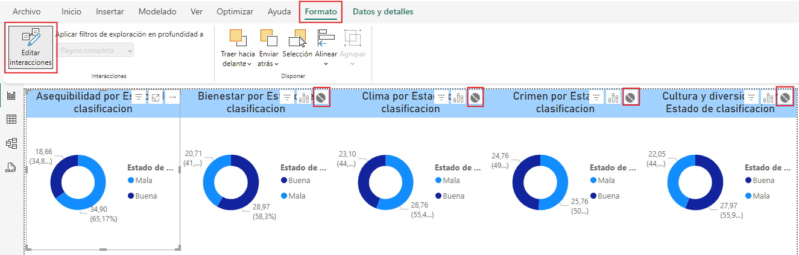

### Tarea 6. Crear botones de navegación.

Los **botones de navegación** permiten mejorar la interactividad y la experiencia del usuario dentro de un informe.

1. En la pestaña **Insertar**, en la sección **Elementos**, da clic en **Botones** y seleccionar el botón **Atrás**.

    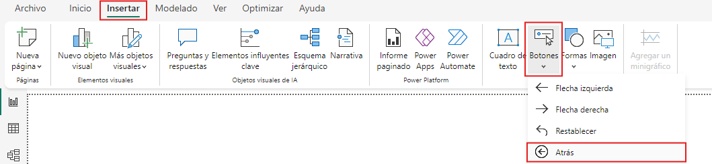

2. Posicionar el botón en la parte superior derecha del lienzo del informe. Sobre el panel de **Formato del botón**, activar el menú **Acción** y en **Tipo** seleccionar **Atrás**.

    > ***Nota:** El botón **Atrás** devuelve al usuario a la página anterior del informe.*
    
    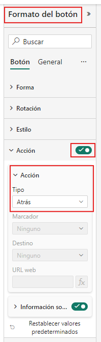

3. Otro escenario de configuración es seleccionar en **Tipo**: **Navegación de página**, esto permite habilitar el menú **Destino**, en este, seleccionar la primera página o la página de inicio (puede renombrar la página). Ahora el botón llevará a la página de inicio.

    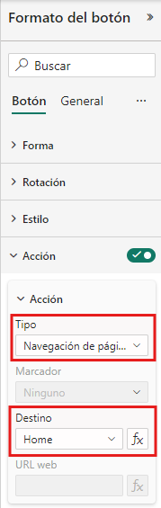

### Rarea 7. Crear filtros de Región.

Con el fin de analizar por página las visualizaciones con base a una región específica, se usará las opciones de filtros en el panel **Filtros**.

1. Arrastrar el campo **Región** a **filtros de esta página**, podrá filtrar la región que desea analizar para los objetos visuales que existan en el lienzo del informe.

    >***Nota**: La opción **Filtros de todas las páginas** permite filtrar todas las páginas en el informe.*

    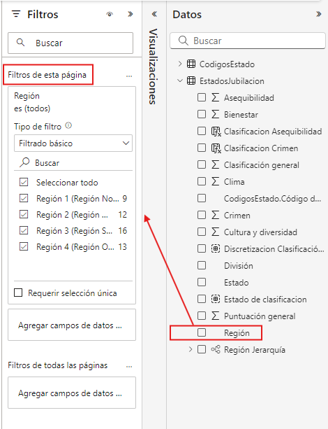

### Resultado esperado:

Se ha realizado varias acciones en el que involucran herramientas de datos, navegación e interacción y filtros. Ahora se puede realizar un análisis de calidad de los datos. 

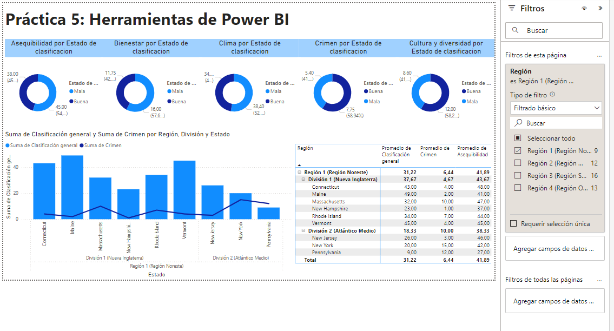
