# Práctica 6. Explorar Power BI Service

## Objetivo de la práctica:

Al finalizar la práctica, serás capaz de:

- Crear un informe a partir de un modelo de datos existente y publicarlo en Power BI Service para compartirlo con otros usuarios.

## Duración aproximada:

- 40 minutos.

## Instrucciones 

**Descripción:** Se ha trabajado en la creación de un informe interactivo, configurando visualizaciones y analizando datos relevantes. Ahora publica el informe en Power BI Service y compártelo en Power BI.

> ***Nota:** En esta práctica usa el archivo resultante del laboratorio anterior: **Práctica 5: Herramientas de Power BI .***

1. Abre el archivo resultante del laboratorio: **Práctica 5: Herramientas de Power BI**.

### Tarea 1. Publicar el archivo en el Servicio Power BI.

1. En la pestaña **Inicio** de la cinta de opciones, da clic en **Publicar**.

    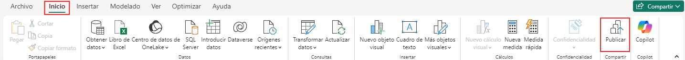

2. **Iniciar sesión** en Power BI.
    
    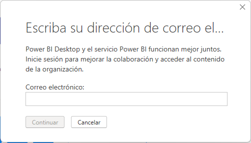

3. En la ventana **Publicar en Power BI**, selecciona área de trabajo de destino para el informe que será publicado. Selecciona **Mi área de trabajo**.

    >***Nota:** Se puede publicar un informe en un área de trabajo que sea accesible para toda la organización, áreas de trabajo disponibles o en área de trabajo propia.*

    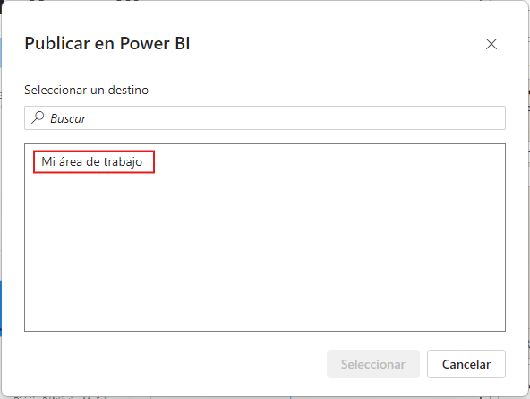

4. Al completar la publicación verá el siguiente cuadro de diálogo:
    
    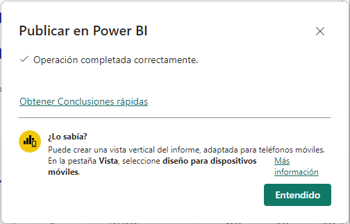

5. Dirigirse a **Power BI Service** e **Iniciar sesión**. En el área de trabajo verá el archivo cargado.

    >***Nota:** Puede ingresar a Power BI Service mediante el enlace: https://app.powerbi.com

    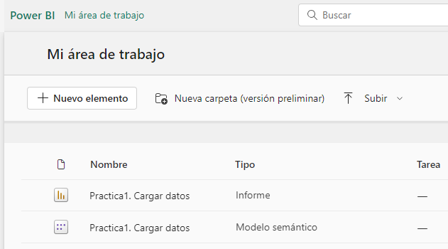

### Tarea 2. Obtener datos, subir archivo de Power BI.

Otra manera de compartir el trabajo es realizar la carga desde el **Servicio de Power BI** directamente.

1. Ingresar al área de trabajo donde desea cargar el archivo de Power BI.

2. Dar clic en el botón **Subir**, seleccionar **Examinar** y por último, buscar el archivo en el dispositivo local de almacenamiento.

    >***Nota:** Podrás cargar un archivo desde otras fuentes de almacenamiento de datos como: **OneDrive** y **SharePoint***.

    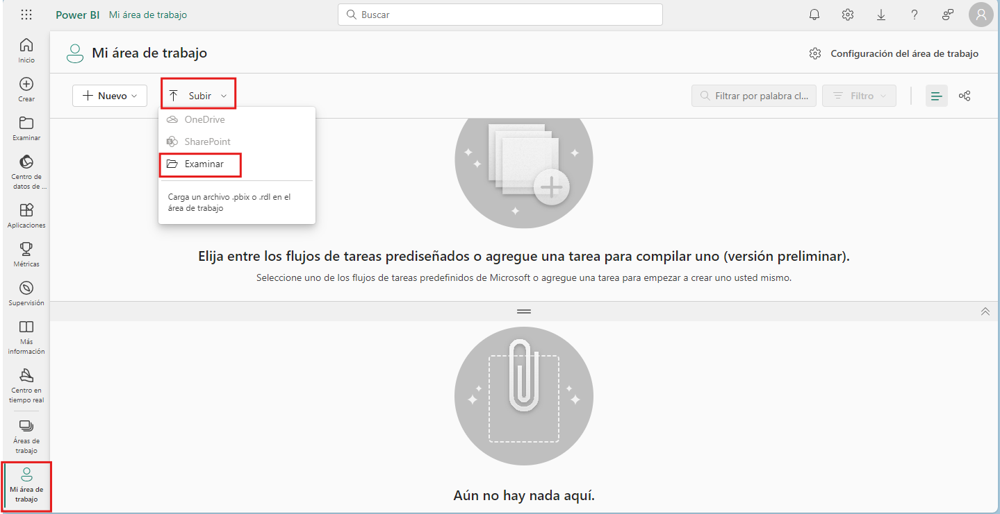

3. Podrá ver en el área de trabajo el archivo cargado. Dar doble clic en el archivo para abrirlo. El servicio de Power BI monstrará la primera página, puedes cambiar de página en el panel derecho **Páginas**.

    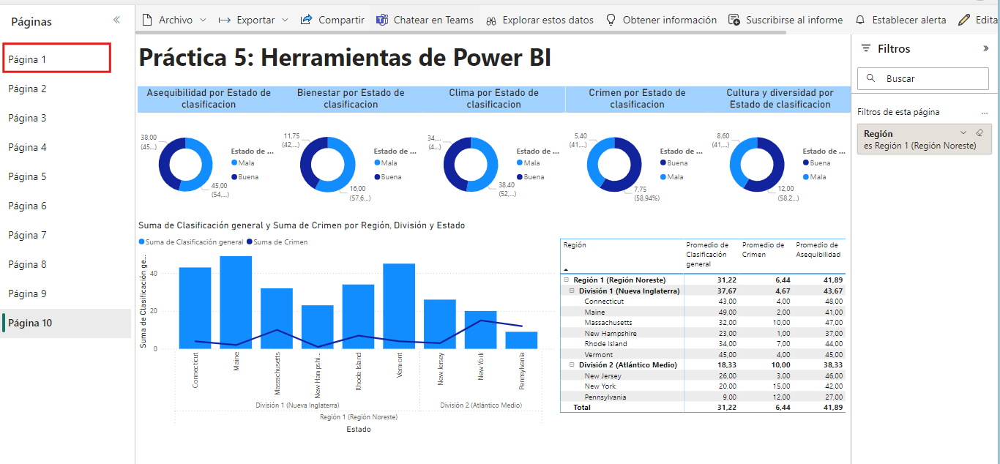

4. Podrá editar y modificar el informe, posterior a ello, puede guardar el informe. Seleccionar **Archivo > Guardar como** en el servicio.

    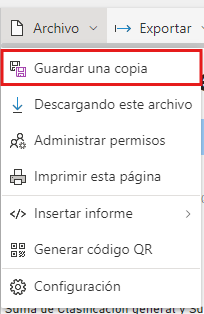

### Tarea 3. Guardar como archivo de PowerPoint.

Es posible exportar el informe de Power BI Service como una presentación de PowerPoint. De este modo, es posible compartir el informe con otros usuarios durante una presentación.

1. Seleccionar **Exportar** en la cinta de opciones y dar clic en la opción **PowerPoint**.

    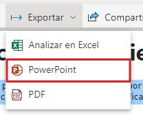

2. En la ventana **Exportar a PowerPoint**, puede elejir como exportar el archivo: **Insertar datos en directo** o **Exportar como imagen**

3. **Exportar como imagen** y seleccionar la opción **Valores actuales**

    >***Nota:** Al finalizar el proceso de exportación, Power BI indica que el archivo PowerPoint se ha guardado y permite saber que está preparado para compartirlo con otros usuarios.

    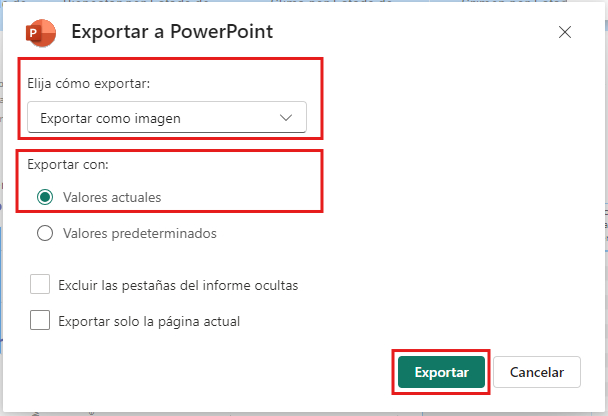

Podrá interacturar con la presentación de PowerPoint, editar, configurar y compartir con otros usuarios.

### Crear un Panel o Dashboard.

Un **panel** o **dashboard** en Power BI es una vista única e interactiva que muestra visualizaciones clave (gráficos, tablas, indicadores, etc.) provenientes de uno o varios informes o conjuntos de datos. Es una herramienta diseñada para ofrecer una visión rápida y resumida del rendimiento de una organización o área específica, ayudando a los usuarios a monitorear y analizar datos en tiempo real.

1. Abrir informe publicado en Power BI Service.

2. Determinar objetos visuales que considere que deben incluirse en el panel.

    >***Nota:** En un panel solo hay una página, es importante seleccionar los objetos visuales más relevantes.

3. Colocar el cursos sobre el objeto visual que desea agregar y dar clic en el icono **Anclar Visualización**.

    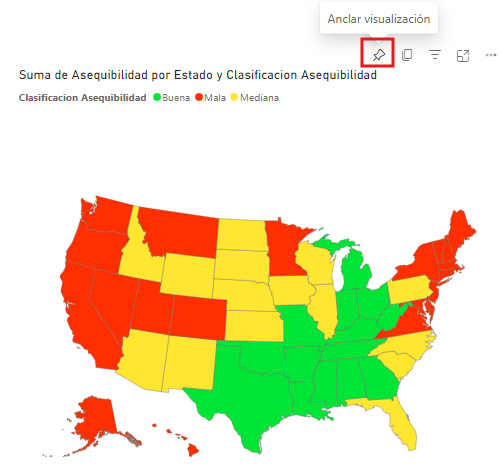

4. En la ventana **Anclar en el panel** podrá configurar **Temas del icono** y seleccionar un panel existente o crear uno nuevo.

5. Seleccionar **Nuevo panel** y nombrarlo **Panel-Power BI Basico**, luego, dar clic en **Anclar**.

    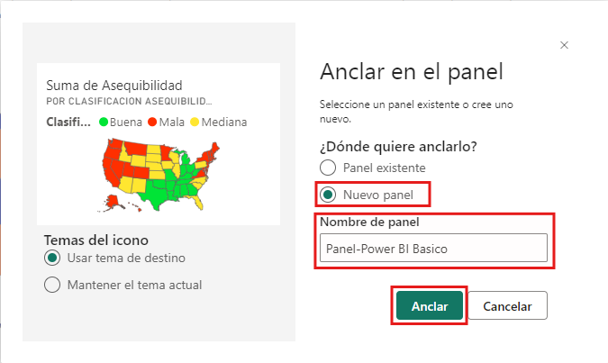

6. En la parte superior derecha aparecerá una notificación cuando el panel esté creado. Dar clic en **Ir al panel**.

    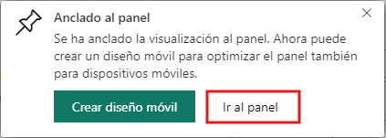

7. Dentro del panel, verá el elemento que acaba de anclar. Realizar el proceso con los demás objetos visuales que desee. 

    >***Nota:** Anclar los objetos visuales adicionales en el panel existente **Panel-Power BI Basico**.

    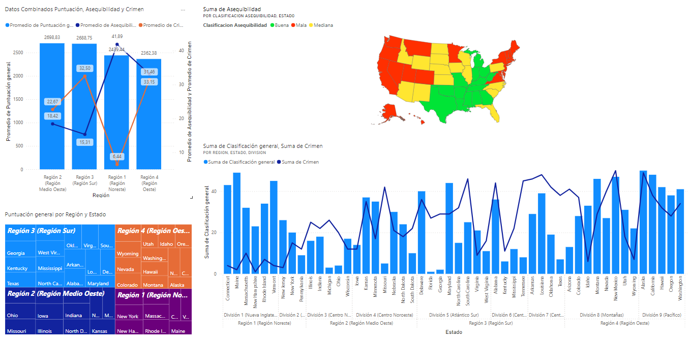

## Resultado esperado:

Ahora sabe cómo crear, compartir informes y paneles, puede usar su imaginación para contrar historias con datos y compartirlos con toda la organización.

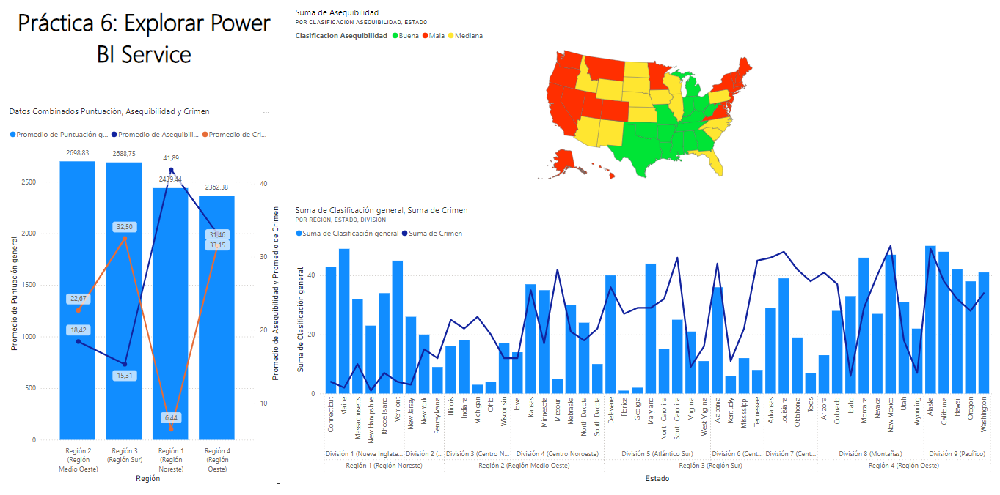

